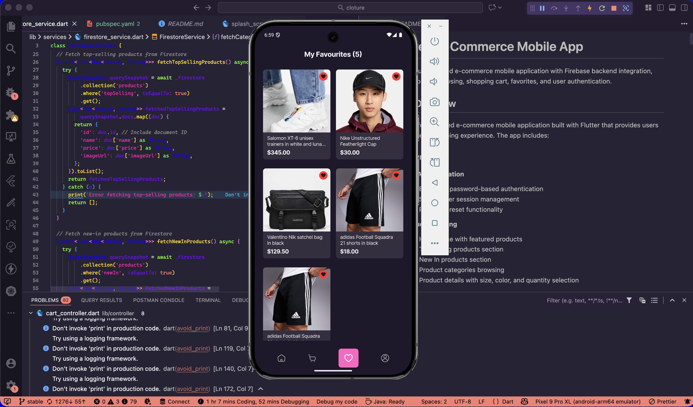
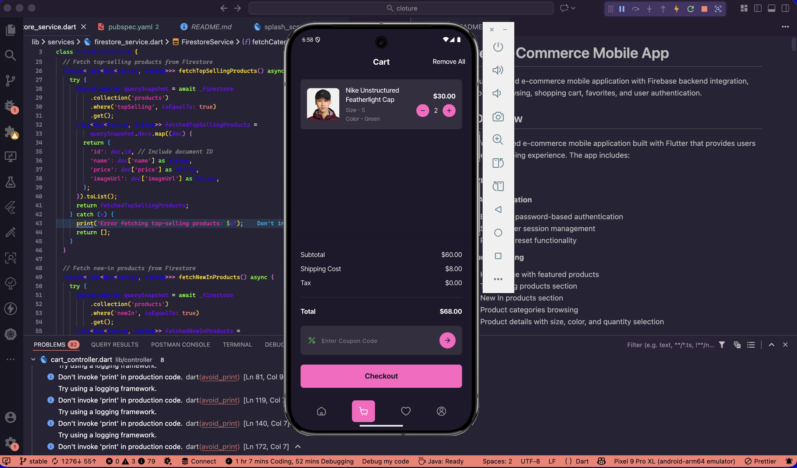
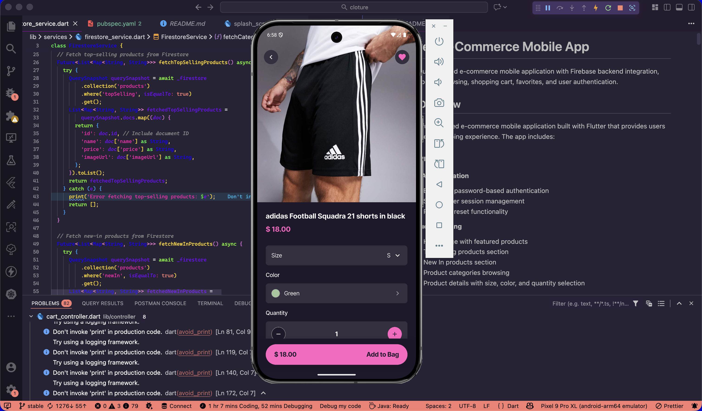
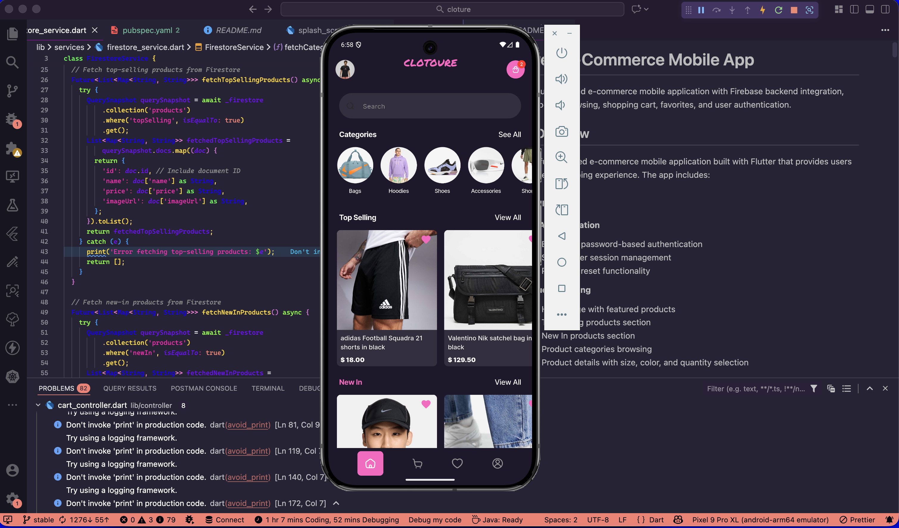
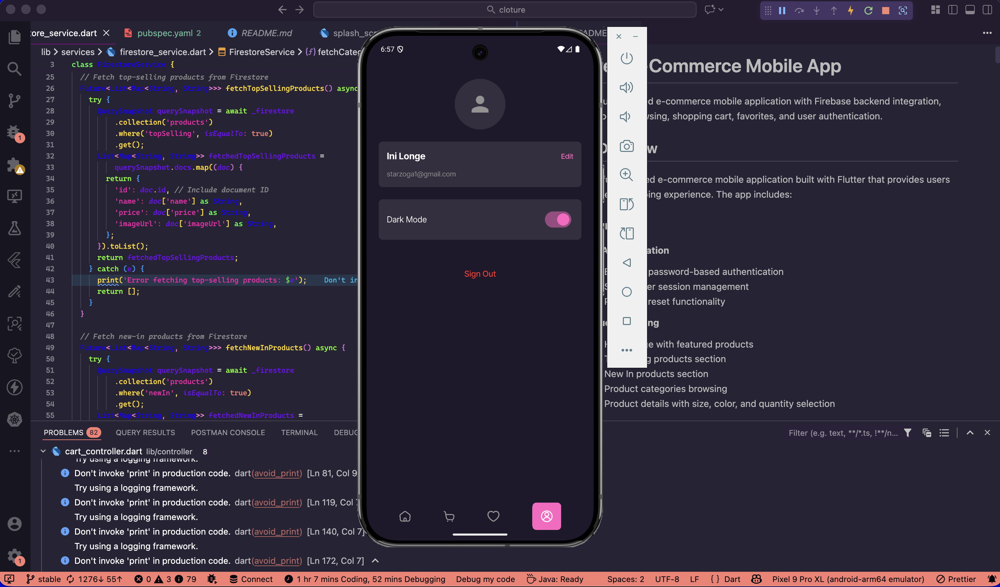

# Cloture - E-Commerce Mobile App

A modern Flutter-based e-commerce mobile application with Firebase backend integration, featuring product browsing, shopping cart, favorites, and user authentication.

## 📱 App Overview

Cloture is a full-featured e-commerce mobile application built with Flutter that provides users with a seamless shopping experience. The app includes:

### Key Features

- **User Authentication**
  - Email and password-based authentication
  - Secure user session management
  - Password reset functionality

- **Product Browsing**
  - Home page with featured products
  - Top Selling products section
  - New In products section
  - Product categories browsing
  - Product details with size, color, and quantity selection

- **Shopping Cart**
  - Add products to cart with size, color, and quantity
  - View and manage cart items
  - Update quantities and remove items
  - Real-time cart synchronization across devices
  - Offline cart support with automatic sync

- **Favorites/Wishlist**
  - Like/unlike products
  - View all favorite items
  - Persistent favorites per user

- **User Profile**
  - View user information
  - Edit profile details
  - Dark/Light mode toggle
  - Sign out functionality

- **Additional Features**
  - Dark mode support with theme persistence
  - Pull-to-refresh functionality
  - Hero animations for smooth transitions
  - Responsive design with screen adaptation
  - Offline support with local caching
  - Real-time data synchronization with Firestore

### Tech Stack

- **Framework**: Flutter (Dart SDK ^3.9.2)
- **Backend**: Firebase (Authentication, Firestore, Storage)
- **State Management**: Provider
- **UI Components**: Material Design 3
- **Font**: Inter (via Google Fonts)
- **Additional Packages**:
  - `flutter_screenutil` - Responsive UI design
  - `liquid_pull_to_refresh` - Pull-to-refresh animations
  - `shared_preferences` - Local data persistence
  - `flutter_secure_storage` - Secure data storage
  - `connectivity_plus` - Network connectivity monitoring
  - `sqflite` - Local database support
  - `flutter_cache_manager` - Caching support

## 🚀 Setup Instructions

### Prerequisites

- Flutter SDK (latest stable version)
- Dart SDK (^3.9.2)
- Android Studio / VS Code with Flutter extensions
- Firebase account and project
- Android Studio / Xcode (for iOS development)

### Installation Steps

1. **Clone the repository**

   ```bash
   git clone <repository-url>
   cd cloture
   ```

2. **Install dependencies**

   ```bash
   flutter pub get
   ```

3. **Firebase Setup**

   **For Android:**
   - Download `google-services.json` from Firebase Console
   - Place it in `android/app/` directory

   **For iOS:**
   - Download `GoogleService-Info.plist` from Firebase Console
   - Place it in `ios/Runner/` directory

4. **Configure Firebase**
   - Create a Firebase project at [Firebase Console](https://console.firebase.google.com/)
   - Enable Authentication (Email/Password)
   - Create Firestore database
   - Set up Firestore collections:
     - `categories` - Product categories
     - `products` - Product information
     - `users` - User data (with subcollections: `cart`, `favorites`)

5. **Run the app**
   ```bash
   flutter run
   ```

### Firestore Database Structure

```
firestore/
├── categories/
│   └── {categoryId}/
│       ├── name: string
│       └── imageUrl: string
├── products/
│   └── {productId}/
│       ├── name: string
│       ├── price: string
│       ├── imageUrl: string
│       ├── topSelling: boolean
│       ├── newIn: boolean
│       └── category: string
└── users/
    └── {userId}/
        ├── firstName: string
        ├── lastName: string
        ├── email: string
        ├── phoneNumber: string
        ├── gender: string
        └── cart/
            └── items/
                └── {itemId}/
                    ├── productId: string
                    ├── name: string
                    ├── imageUrl: string
                    ├── price: number
                    ├── size: string
                    ├── color: string
                    ├── quantity: number
                    └── timestamp: timestamp
        └── favorites/
            └── items/
                └── {itemId}/
                    ├── productId: string
                    ├── name: string
                    ├── imageUrl: string
                    ├── price: number
                    └── timestamp: timestamp
```

### Building for Production

**Android APK:**

```bash
flutter build apk --release
```

**Android App Bundle:**

```bash
flutter build appbundle --release
```

**iOS:**

```bash
flutter build ios --release
```

## 📸 Screenshots











## 🏗️ State Management Approach

This application uses **Provider** as the state management solution, following the recommended Flutter state management pattern.

### Architecture Overview

The app follows a **clean architecture** pattern with clear separation of concerns:

```
lib/
├── controller/          # State management (Provider)
├── services/           # Business logic & API calls
├── model/              # Data models
├── view/
│   ├── screens/        # UI screens
│   ├── widgets/        # Reusable UI components
│   └── constants/      # Constants (colors, text styles, etc.)
└── utils/              # Utility functions
```

### State Management Implementation

#### Controllers (ChangeNotifier)

The app uses multiple controllers, each extending `ChangeNotifier`:

1. **SplashController**
   - Manages splash screen state
   - Handles authentication check
   - Navigation logic

2. **ThemeController**
   - Manages dark/light mode state
   - Persists theme preference using SharedPreferences
   - Provides theme-aware colors

3. **CartController**
   - Manages shopping cart state
   - Handles add/remove/update cart items
   - Calculates totals (subtotal, tax, shipping, total)
   - Real-time synchronization with Firestore
   - Offline support with local caching

4. **FavoritesController**
   - Manages favorites/wishlist state
   - Handles add/remove favorites
   - Real-time synchronization with Firestore
   - Offline support with local caching

5. **GenderController**
   - Manages user gender preference
   - Loads and saves gender selection

#### Provider Setup

The app uses `MultiProvider` to provide all controllers globally:

```dart
MultiProvider(
  providers: [
    ChangeNotifierProvider(create: (_) => SplashController(...)),
    ChangeNotifierProvider(create: (_) => GenderController()),
    ChangeNotifierProvider(create: (_) => ThemeController(...)),
    ChangeNotifierProvider(create: (_) => CartController(...)),
    ChangeNotifierProvider(create: (_) => FavoritesController(...)),
  ],
  child: MaterialApp(...),
)
```

#### Usage in UI

Controllers are accessed in widgets using:

- **Consumer**: For listening to specific controller changes

  ```dart
  Consumer<CartController>(
    builder: (context, cartController, child) {
      return Text('Items: ${cartController.totalItems}');
    },
  )
  ```

- **Consumer2/Consumer3**: For listening to multiple controllers

  ```dart
  Consumer2<ThemeController, CartController>(
    builder: (context, themeController, cartController, child) {
      // Access both controllers
    },
  )
  ```

- **context.read()**: For one-time access (in callbacks)

  ```dart
  final cartController = context.read<CartController>();
  await cartController.addToCart(...);
  ```

- **context.watch()**: For listening to changes (alternative to Consumer)
  ```dart
  final cartController = context.watch<CartController>();
  ```

### Data Flow

1. **User Action** → Widget calls controller method
2. **Controller** → Updates state and calls service
3. **Service** → Interacts with Firestore/local storage
4. **Service** → Returns data to controller
5. **Controller** → Calls `notifyListeners()`
6. **UI** → Rebuilds via Consumer/Provider

### Benefits of Provider

- ✅ Simple and easy to understand
- ✅ Recommended by Flutter team
- ✅ Minimal boilerplate code
- ✅ Good performance with selective rebuilds
- ✅ Easy to test
- ✅ Works well with dependency injection

### Services Layer

Services handle all business logic and data operations:

- **AuthService**: Firebase Authentication operations
- **CartService**: Cart CRUD operations with Firestore
- **FavoritesService**: Favorites CRUD operations with Firestore
- **FirestoreService**: Product and category fetching
- **StorageService**: Unified local storage (SharedPreferences + Secure Storage)
- **ConnectivityService**: Network connectivity monitoring

### Offline Support

The app implements offline-first architecture:

- **Local Caching**: Cart and favorites are cached locally using SharedPreferences
- **Automatic Sync**: When connection is restored, local changes sync to Firestore
- **Optimistic Updates**: UI updates immediately, syncs in background
- **Real-time Listeners**: Firestore streams provide real-time updates when online

## 📁 Project Structure

```
lib/
├── controller/              # State management controllers
│   ├── auth_controller.dart
│   ├── cart_controller.dart
│   ├── favorites_controller.dart
│   ├── gender_controller.dart
│   ├── splash_controller.dart
│   └── theme_controller.dart
├── model/                   # Data models
│   ├── cart_item.dart
│   └── favorite_item.dart
├── services/                # Business logic & API services
│   ├── auth_service.dart
│   ├── cart_service.dart
│   ├── connectivity_service.dart
│   ├── favorites_service.dart
│   ├── firestore_service.dart
│   ├── product_service.dart
│   └── storage_service.dart
├── view/
│   ├── constants/           # Constants and theme
│   │   ├── bottom_nav_screen.dart
│   │   ├── colors.dart
│   │   ├── text.dart
│   │   ├── textfield.dart
│   │   └── theme_colors.dart
│   ├── screens/             # App screens
│   │   ├── authentication/
│   │   ├── favourites/
│   │   ├── home/
│   │   ├── orders/
│   │   ├── product/
│   │   └── profile/
│   └── widgets/             # Reusable widgets
│       ├── buttons.dart
│       ├── shimmer_widget.dart
│       └── toast_widget.dart
└── main.dart                # App entry point
```

## 🔧 Configuration

### Environment Variables

The app uses Firebase configuration files:

- Android: `android/app/google-services.json`
- iOS: `ios/Runner/GoogleService-Info.plist`

### Screen Adaptation

The app uses `flutter_screenutil` with design size:

- Design Size: 375 x 812 (iPhone X)
- All dimensions use `.spMin` extension for responsive sizing

## 🧪 Testing

To run tests:

```bash
flutter test
```

## 📝 License

This project is private and not intended for public distribution.

## 👥 Contributors

[Add contributor information here]

## 📞 Support

For issues and questions, please contact [your contact information].

---

**Built with 💙 using Flutter**
